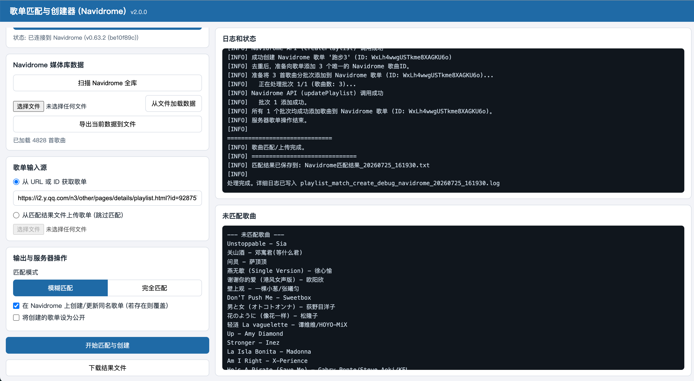

# Playlist Matcher for Navidrome

## v2.0.0 更新说明
- 从 CustomTkinter 桌面 GUI 重构为 Web 应用（Flask + SSE），浏览器中使用，无需安装桌面依赖
- 代码分层：业务逻辑全部迁移至 `core.py`，新增 Flask 服务层 `app.py` 与单页面前端 `templates/index.html`
- 日志、未匹配列表、弹窗告警通过 SSE 实时推送到浏览器
- 媒体库导出/加载、匹配结果下载均通过浏览器文件下载完成
- 新增 `.gitignore`
- 移除 `customtkinter` 依赖，新增 `flask` 依赖

## 如何启动

要求 Python 3.8+。

```bash
# 创建虚拟环境（推荐）
python3 -m venv .venv

# 激活虚拟环境
source .venv/bin/activate   # Windows: .venv\Scripts\activate

# 安装依赖
pip install -r requirements.txt

# 启动
python app.py
```

启动后会自动打开浏览器访问 http://127.0.0.1:5000 ；如需修改端口，先设置环境变量 `PORT` 再启动。

> Apple Music 歌单导入依赖本机 Chrome 浏览器与 chromedriver；QQ 音乐、网易云音乐无此要求。



---

本项目 Fork 自 [CTZZG/playlist-matcher](https://github.com/CTZZG/playlist-matcher)。
